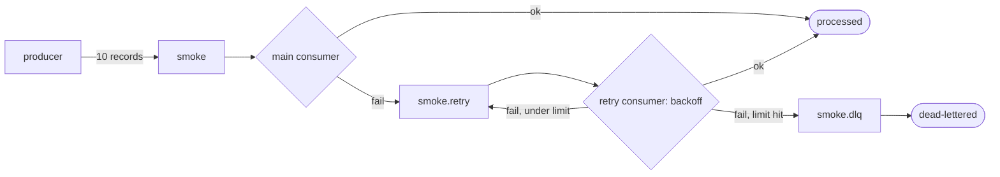

# Kafka: durability, queues, and streaming on a 5-broker cluster

**Goal:** build fluency in Kafka's guarantees by driving a real 6-broker
cluster from a client and watching it on a dashboard — then breaking it.

**Teaches:** how `acks` + `min.insync.replicas` + the ISR decide whether an
acked record survives a broker failure (durability vs availability), how
consumer groups split partitions and rebalance (the queue use case), and how
keys, ordering, and delivery semantics play out under load (the streaming use
case). This file covers the **scaffold**; each drill gets its own section as
it lands.

## Topology

```
 producer / consumer ─► broker1..broker5  :19092 .. :19096  (host)
                          └── KRaft controller quorum + ISR replication ──┘
                                          ▲
                                    toxiproxy :8475 (idle; drills cut a broker here)
```

Five combined broker+controller nodes in KRaft mode (no ZooKeeper). Clients
reach them via the per-broker EXTERNAL listeners on the host (broker N →
`:1909(1+N)`). Toxiproxy is up but idle — later drills route a broker through
it to model a partition, the same chaos lever the
[`01-PACELC/`](../01-PACELC/) stack uses.

## Run

```bash
02-KAFKA/docker/start.sh     # 3 brokers + monitoring; waits for the cluster
cd 02-KAFKA/ts && pnpm install

pnpm smoke                   # produce 10, then exercise the retry + DLQ flow

cd ../.. && 02-KAFKA/docker/stop.sh
```

## Consumer retries & DLQ

Kafka has no built-in consumer retry. `pnpm smoke` rolls the standard pattern:
the main consumer forwards a failed record to a separate **retry topic** (the
attempt count rides in a header), a retry consumer reprocesses it with backoff,
and after `MAX_RETRIES` it's parked in a **dead-letter queue** for later
inspection. Retries live on their own topics, so a poison record never
head-of-line-blocks the main consumer.



Seeded misbehavers: `msg-7` is flaky (recovers on retry attempt 2) and `msg-3`
is poison (exhausts 3 attempts → DLQ) — so a run ends 9 processed, 1
dead-lettered.

## Watch it

- **Grafana** — http://localhost:3006 → dashboard *"Kafka — cluster overview"*
  (brokers online, under-replicated partitions, ISR size, offsets, consumer lag).
- **Kafka UI** — http://localhost:8089 (the standard Kafka UI) to browse topics,
  partitions, offsets, and consumer groups directly.
- **Console** — http://localhost:8088 (Redpanda Console, same data, different UI).
- **Prometheus** — http://localhost:9091/targets.

## Drills (planned)

1. **Durability vs availability** — `acks` + `min.insync.replicas`, kill a
   broker mid-write, watch acked-record survival vs the producer blocking.
2. **Message queue** — consumer groups, partition assignment, rebalancing,
   consumer-lag drain.
3. **Streaming** — keys→partitions, ordering, at-least-once vs exactly-once.

**Status:** 🟢 scaffold runs end-to-end (`pnpm smoke` produces/consumes 10/10);
drills not started.
