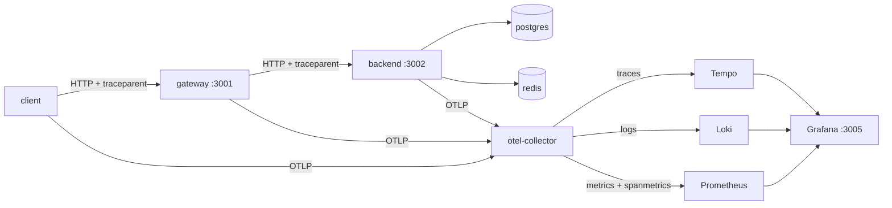

# 03-OTEL

All three OpenTelemetry signals, end to end, correlated in one Grafana. A
two-service app (`client → gateway → backend`) emits **traces**, **metrics**,
and **logs** over OTLP to a single collector, which fans them out to Tempo,
Prometheus, and Loki.



## What it demonstrates

- **Distributed tracing** — `traceparent` propagates across the gateway→backend
  hop, so one trace tree spans both services down to the pg/redis calls. HTTP,
  pg, and redis spans are auto-instrumented; business steps
  (`validate-cart`, `reserve-inventory`, `persist-order`) are manual spans.
- **spanmetrics** — the collector derives RED metrics (`calls`, `duration`)
  from spans automatically. You instrument traces; rate/error/latency come free.
- **Exemplars** — metric samples carry a `trace_id`. Click an exemplar dot on a
  latency panel → jump to a representative trace.
- **Trace-correlated logs** — pino lines are stamped with `trace_id` and shipped
  to Loki; a derived field links each log back to its trace.

## Run

```bash
cd docker && ./start.sh          # postgres, redis, collector, tempo, loki, prometheus, grafana

cd ../ts && pnpm install
pnpm start:backend               # :3002
pnpm start:gateway               # :3001   (separate terminal)
pnpm load                        # drives traffic (separate terminal)
```

The three `pnpm` processes run on the host and export OTLP to the collector on
`localhost:4318`. `OTEL_SERVICE_NAME` is set per process by the scripts.

## What to look at (Grafana → http://localhost:3005)

1. **Dashboard "OTEL demo — RED + exemplars"** — request rate, error rate, and
   p95 latency, all derived from spans. The latency panels show exemplar dots;
   click one to open the trace.
2. **Explore → Tempo** — Search for traces (filter by service, by errored, by
   duration > 500ms to catch the injected slow path). Open one: client → gateway
   → backend → redis/pg. From a span, use the links to its **logs** and **metrics**.
3. **Explore → Loki** — `{service_name="backend"}`. Each line has a `trace_id`
   with a **View trace** link.

## Notes

- ~10% of orders hit a `payment declined` error and ~10% take an injected
  ~0.5–1s detour, so the error-rate and latency panels have something to show.
- pg is `tmpfs` and Tempo/Loki use ephemeral storage — all state is wiped on
  `./stop.sh`. This is a lab.
- The TS project is CommonJS so `require`-based auto-instrumentation patches
  reliably; `telemetry.ts` is imported first in every entrypoint for the same
  reason.
